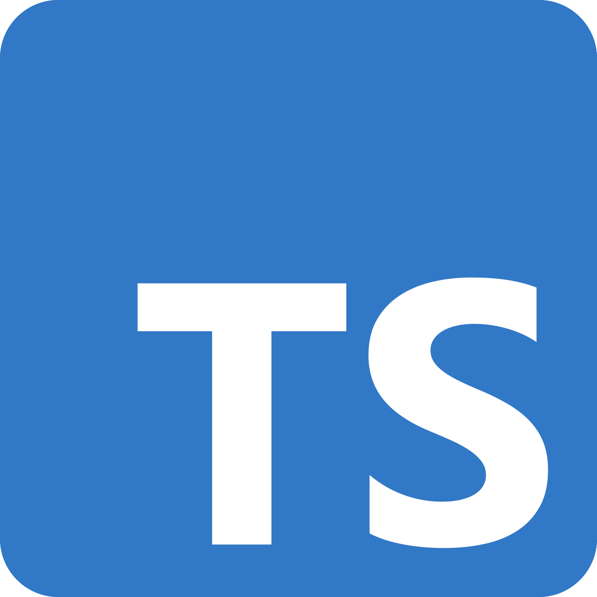

    

### Introduction:
My experience using Typescript these past couple of weeks did leave a bit of an impression on me. At first, I noticed 
similarities between Typescript and other languages. For instance, Typescript has an abundance of libraries and modules 
from a wide range of groups and people, similar to Python. It is typed similarly to Swift, Apple's programming language.
For example, functions, variables, and classes are typed in similar, if not identical ways. For me, it has made learning Typescript
less troubling. 

### First Impression of Typescript
With Typescript's obvious relation with Javascript, I thought Typescript would be best used for web applications. Though, I have seen many 
projects using Javascript/Typescript for applications beyond. Prior to using Typescript/Javascript I never understood why programmers would use them outside of web applications,
This changed as I was using it but I thought other languages would be better suited for other types of projects. I also was simply not as attracted to languages like Typescript 
simply because of my main interest on lower level programming languages used for systems programming.

### Realization
I have come to realize why some programmers find this language so attractive. Typescript's provides excellent documentation and updated learning resources. These resources make learning the language 
easy. Typescript also appears to have a thriving community building applications for and with Typescript, making Typescript more versatile and applicable in modern programming.  
