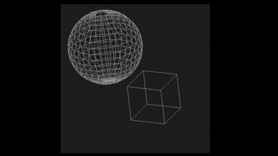

# Pygame3D 

Using another rendering library I have grown to like is the pygame library.

This library was one of the first libraries I have every used. 

The code was later used in the Star Fleet II Deluxe Demo project I contributed to.

This program projects 3D objects to the screen using and performs transformations on them using numpy. 

To those interested [here is the repository](https://github.com/raffyrivers/Pygame3D.git). 

    

