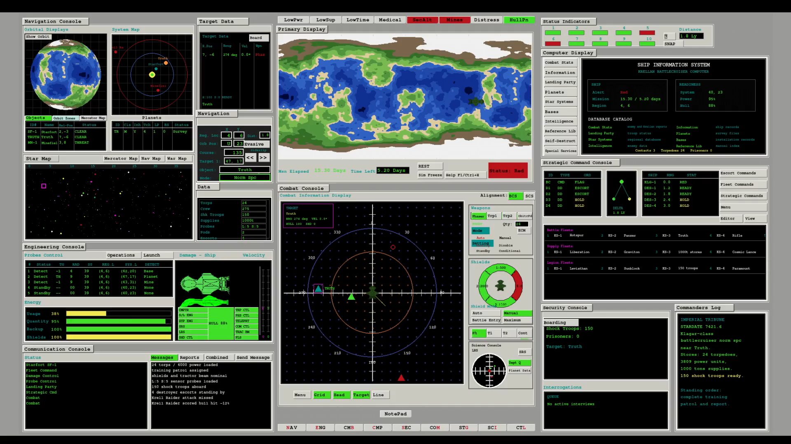

# Star Fleet II Deluxe Demo
For all of 2025 and the last half of 2026 I was an intern for the company [Interstel Technnologies](https://www.interstel.tech/). 
This Demo would act as a teaser to the full game. 
[Here is the repository](https://github.com/raffyrivers/StarFleetTwoDeluxeUI.git).
Currently a WIP.

    

